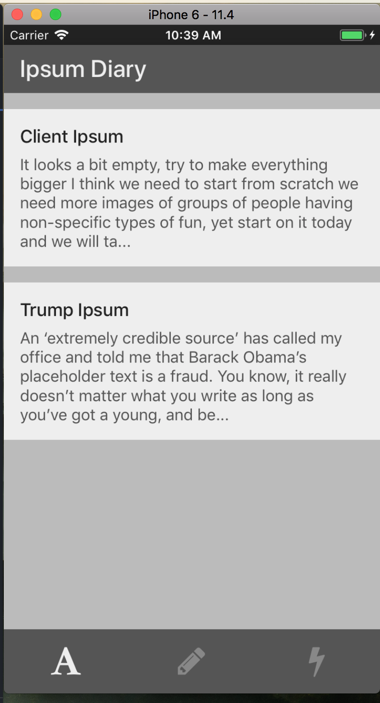

# Advanced React Native Workshop - Ipsum Diary

# In Iteration 5

Just a copy of Master branch. Here we'll discuss about the UX and PixelRatio.
An example of PixelRatio implemented by me is shown in https://github.com/treebohotels/leaf-ui/pull/99.

## Problem Statement

To create a React Native Notes App with all CRUD operations, and to discuss some more advanced concepts.

## Workshop Agenda

1. Recap to the previous workshop - [React Native Workshop Repo](https://github.com/ReactBangalore/react-native-workshop)
2. Use [JSON Server](https://github.com/typicode/json-server]) to setup a basic server, test all basic end points
3. Setup the React Native project using `react-native init`.
4. Add ListingScreen and a NewPostScreen
    - Use NewPostScreen to make a new post
    - List all the posts on the ListingScreen
5. Add Edit Post and Delete Post options
6. Debugging like a pro
    - Demo React Native Debugger
    - Demo Reactotron
7. Discuss great UI practices
8. Adding Deep Linking to your app

## Getting started

You can verify your dependencies in the **Build Projects with Native Code** section of https://facebook.github.io/react-native/docs/getting-started.html 

#### First Terminal Window
1. Clone this repo and run `yarn` or `npm install`
2. `npm start`

#### Second Terminal Window
1. `npm install -g react-native-cli`
2. `react-native run-ios` or `react-native run-android`

## Setting up the Server

1. `npm install -g json-server`
2. In the root of this repo is a folder called jsonServer - `cd` to that
3. `json-server --watch db.json`
